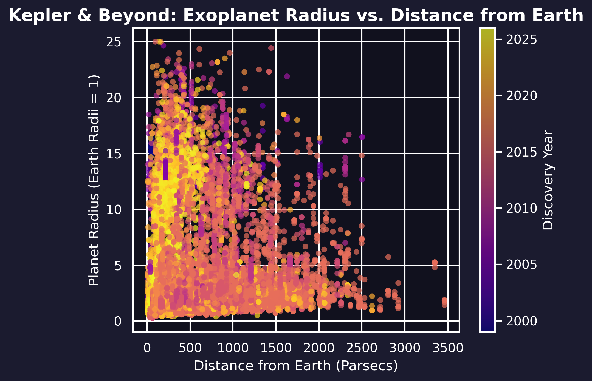

# Exoplanet Discovery Analysis (NASA Kepler Data)

An end-to-end Exploratory Data Analysis (EDA) project analyzing over 5,700 exoplanet records directly fetched from the live **NASA Exoplanet Archive API**. This project evaluates planetary dimensions, discovery timelines, and spatial distances to map out historic space discovery milestones.

---

## Tech Stack
* **Language:** Python
* **Libraries:** Pandas (Data Wrangling), NumPy, Matplotlib & Seaborn (Advanced Visualization)

---

## Core Analytical Tasks Performed
* **API Integration:** Streamed live stellar dataset via NASA's database query system.
* **Data Cleaning & Filtering:** Addressed missing cosmic attributes across critical metrics (`pl_rade`, `sy_dist`) and filtered large gas giant outliers to focus on planetary systems within 25 Earth Radii.
* **Aggregations & Trends:** Grouped discovery methods to analyze the historical peak era of the **Transit Method** (pioneered by the Kepler Space Telescope).
* **Data Visualization:** Built a multi-dimensional scatter plot tracking distance from Earth vs. planet size, using a color-mapped timeline to illustrate discovery years.

---

## Key Insights
* **The Golden Era:** A dramatic surge in planetary discoveries occurred in the mid-2010s (specifically peaking around 2014–2016), correlating with massive batches of verified data released from NASA's Kepler mission using the Transit Method.
* **Telescope Thresholds:** Most discovered Earth-sized planets (Radius $\approx$ 1) are clustered relatively close to us (under 1000 Parsecs), highlighting current technical limits in detecting tiny worlds across deep-space distances.

---

## Project Visualization

Below is the generated multi-dimensional scatter plot showing the relationship between a planet's radius, its distance from Earth, and its discovery year:

